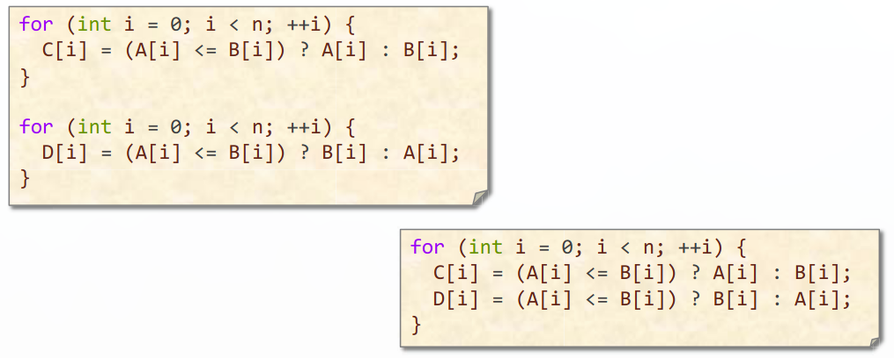

**Bentley Rules for Optimizing Work**

  The **work** of a program (given input) is the sum total of all the operations executed by the program.
  
  Reducing the work of a program **does not** automatically reduce its running time, however, due to the **complex nature of computer hardware**
  
  **Bentley Rules**
  1. Data Structures

- **Packing and Encoding**:
    - The idea of packing is to store more than one data value in a machine word. 
    - The idea of encoding is to convert data values into a representation requiring fewer bits.
    - Sometimes, unpacking and decoding are the optimization, depending on whether more work is involved moving the data or operating on it.
  

 - **Augmentation**:
     -  The idea of data-structure augmentation is to add more information to a data structure to make common operations do less work.

- **Precomputation**:
    - The idea of precomputation is to perform calculations in advance so as to avoid doing them at "mission-critical" times.
    - Precompute Pascal's Triangle:

- **Compile-Time Initialization**
    - The idea of compile-time initialization is to store the values of constants during compilation, saving work at execution time. 
    - We can create these type of table using **metaprogramming**, such that the program will write the C code for us.

- **Caching**
    - The idea of caching is to store results that have been accessed recently so that the program doesn't need to compute them again.
    - About 30% faster if cache is hit ⅔ of the time.

- **Sparsity**
    - The idea of exploiting sparsity is to avoid storing and computing on zeroes. "The fastest way to compute is not to compute at all."

2. Logic
- **Constant Folding and Propagation**
    - The idea of constant folding and propagation is to evaluate constant expressions and substitute the result into further expressions, and during compilation.

- **Common-Subexpression Elimination**
    - The idea of Common-Subexpression Elimination is to avoid computing the same expression multiple times by evaluating the expression once and storing the result for later use.

- **Algebraic Identities**
    - The idea of Algebraic Identities is to replace expressive algebraic expressions with algebraic equivalents that require less work.

- **Short-Circuiting**
    - When performing a series of tests, the idea of Short-Circuiting is to stop evaluating as soon as you know the answer.

- **Ordering Tests**
    - Consider code that executes a sequence of logical test. The idea of ordering tests is to perform those that are more often "sucessful" - a particular alternative is selected by the test - before tests that are rarely sucessful. Similarly, inexpensive tests should precide expensive ones.

- **Combining Tests**
    - The idea of combining tests is to replace a sequence of tests with one test or switch.

3. Loops
- **Hoisting**:
    - The goal of hoisting — also called loop-invariant code motion — is to avoid recomputing loop-invariant code each time through the body of a loop.
 
 
 - **Sentinels**:
     - Sentinels are special dummy values placed in a data structure to simplify the logic of boundary conditions, and in particular, the handling of loop-exit tests.

- **Loop Unrolling**:
    - **Loop unrolling** attempts to save work by combining several consecutive iterations of a loop into a single iteration, thereby reducing the total number of iterations of the loop and, consequently, the number of times that the instructions that control the loop must be executed.
    - Benefits of loop unrolling:
        - Lower number of instructions in loop control code
        - Enables more compiler optimizations
    - Unrolling too much can cause poor use of instruction cache
    - **Full loop unrolling**: All iterations are unrolled.

    - **Partial loop unrolling**: Several, but not all, of the iterations are unrolled

- **Loop Fusion**:
    - The idea of loop fusion — also called jamming — is to combine multiple loops over the same index range into a single loop body, thereby saving the overhead of loop control.

- **Eliminating Wasted Iterations**
    - The idea of eliminating wasted iterations is to modify loop bounds to avoid executing loop iterations over essentially empty loop bodies.

4. Function
- **Inlining**
    - The idea of inlining is to avoid the overhead of a function call by replacing a call to the function with the body of the function itself.

- **Tail-Recursion Elimination**
    - The idea of tail-recursion elimination is to replace a recursive call that occurs as the last step of a function with a branch, saving function-call overhead.

- **Coarsening Recursion**
    - The idea of coarsening recursion is to increase the size of the base case and handle it with more efficient code that avoids function-call overhead

