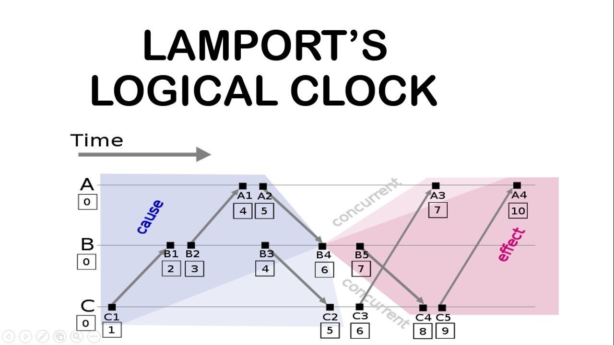

What is the other name of Lamport diagrams?
- SpaceTime diagrams
 

**The -> (Before Relation)**: 
- Definition: 
    - Given two events A&B, we say A->B ("A happened before B") if any of the following is true:
        - A and B occur on the same process line with B after A.
        - A is a message send event and B is the correspoding receive event.
        - If A->C, and C->B; then A->B (transitive closure)
- Properties:
    - Irreflexive -> **not partial ordered**
    - Transitivity (vacuous truth)
    - Anti-symmetry

**Network Model**:
A **synchronous** network is one where there exist an _n_ such that no message takes longer than _n_ units of time to be delivered.

An **asynchronous** network is one where there exists no such _n_.

When 2 event Q,R such that $Q \not\to R$ and $R \not\to Q$ , we call those events are **concurrent** / independent (symbol: $Q\|R$).

**Partial Orders**
- Definition: 
    - A set S, together with
    - A binary relation usually, but not always, e.g: written as $\le$ , that lets you compare things from S, and has these 3 properties:
        - Reflexitivity: $\forall a \in S, a \le a$.
        - Anti-symmetry: $\forall a,b \in S, \ if \ a \le b \ and \ b\le a, \ then \  a=b$. 
        - Transitivity: $\forall a,b,c \in S, \  if \  a \le b \ and \  b\le c; then \  a \le c$, 

