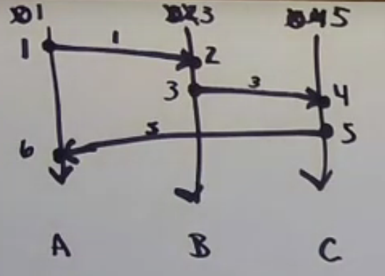

**What is a Distributed System?**

Martin Kleppman's definition
> A collection of computing nodes connected by a network and characterised by partial failure

Peter Alvaro's definition  
>  A collection of computing nodes connected by a network and characterised by partial failure and unbounded latency

**Assign Lamport Clocks to events**
1. Every process has a counter, initially 0.
2. On every event, a process increments its counter.
3. When sending a message, a process includes its current counter along with the message.
4. When receving a message, set your counter to $max(local counter, message counter) + 1$ 

**Property of Lampert Clock**:
1. If $A \to B$ , then $LC(A) \lt LC(B)$ , but not vice versa.
    -> If $\urcorner (LC(A) < LC(B))$ ; then $\urcorner(A \to B)$ 
2. LCs do not characterize causality