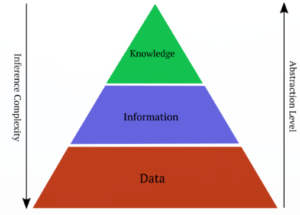
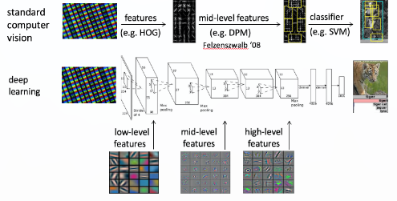

1. Humans have the remarkable ability to infer many physicalproperties and attributes only by looking at an image: the 3D shape, the materialproperties, the lighting conditions, or wether the object is a cat or a dog.
2. Computersfacilitate this miracle by representing the images using millions of rectangular partscalled pixels. Each pixel can be described by three numbers. The numbers correspondto red, green and blue colours and determine how much light should be emitted fromthat part of the image, when it is displayed on the screen.
3. 1
4. 
5. Classification been the long-standing research topics inthe field of computer vision, largely because they can help to solve a wide rangeof visual recognition and understanding problems
6. In the real-world cases, the same object can be exhibited under different va-riations, including appearance, translation, scale, pose, viewpoint, occlusion andso on. -> expected to be ableto effectively handle these variations, and feature representations are the essentialcomponent for achieving this.
7. Feature: 
    - When we want to replicate vision in computers we run into problems. It turnsout that pixels are not very useful at determining the attributes of objects in images.
    - The pixel space is not appropriate for the complex computer vision tasks,e.g.objectclassification, detection, etc. Every single pixel value does not convey much informa-tion about the objects that they belong to
    - 
 
    - need to have better representations than pixels, that let us solve computervision tasks
    - Traditional methods use hand-crafted functions called features.
    - Feature representations are used to transform the rawpixels of images into data that can be effectively tackled by the classification
    - They should be invariant to the complex object variations, andthey have always been the driving force behind the research of computer vision forthe past two decades \[BCV13\]..
    - The feature descriptors used for image representati-ons have experienced shifts from the low-level global features \[TC88\], such as color,texture and shape features, to the hand-crafted local invariant descriptors, such asScale-Invariant Feature Transform (SIFT) \[L
    - The tra-ditional approaches of computer vision tasks involve a multi-stage pipeline where atfirst the images are transformed to a feature space via handcrafted feature extractionmethods and then consequenced with the targettínhdụ task solution in the feature space.The feature extraction stage involves mapping the input image to a feature spacethrough a fixed hand designed function. The resulted features may represent lowlevel \[23,66\] or mid-level \[31\] attributes. The advantage of the handcrafted featureextraction methods is that they do not involve much training and are less dependenton data accordingly. Their disadvantage is that it is too complex to design properfeature extractors manually.
    - In computer vision, afeatureis the result of a neighborhood operation appliedto the image. The role of this operation is to collect certain information fromthis neighborhood, which is usually summarized in a vector with fixed dimension.Depending on the relative size of this neighborhood to the size of the image, thefeature collects either local (local feature) or global (global feature) information.The statistics collected by the features are used to determine whether an imagecontains certain properties or not. The characteristics of these properties dependon the task at hand and can vary from low level structures, such as existence ofcertain local edge orientations, to high level structures, such as existence of certainobject categories in an image. Usually when faced with a computer vision problemthe first step is to determine which type of feature is the most suitable for the task
    - 

8. The long-awaited breakthrough came about ten years later in application ofneural networks. It came somewhat unexpected at times when large portion ofresearch community stopped paying attention to them. Neural networks are one ofthe oldest models that many people perceive as failed endeavor
9. In the midst of all this is one specific model that is most likely the largest contrib-utor to current state of affairs.
10. Instead of using those features the majority of recent methods use neural networks tolearn computer vision tasks. Neural networks are complicated functions with manyparameters, where the parameters are learned using gradient descent methods, wherethe objective is computed on a training dataset. Each layer in the network can bethought of as an image representation that is learned from the training data
11. In recent years, another line of machine learning approaches, known as deeplearning \[BCV13\], has greatly stimulated the development of various visual recog-nition tasks \[RASC14\], including image classification and retrieval.
12. Deep learningmodels attempt to learn high-level abstractions of the input data automatically viamultiple processing stages or layers, with the output of each stage being the inputto the next. This mechanism is inspired by the hierarchical non-linear processingof visual recognition in the human brain \[Ros58\], during which the features areextracted starting from the raw signals to gradually more abstract and complexrepresentations. With this biological plausibility, deep learning models are deemedto learn good internal feature representations of the visual worlds automatically.
13. Deep learning based feature representations, especially those learned by the deepconvolutional neural networks (CNN), have demonstrated superior performance tothe conventional hand-engineered shallow representation models
14. Moreover, recent studies have shown that the features of deep CNNs, whichhave been trained on sufficiently large and diverse image classification datasets, e.g.,ImageNet \[DBLFF10\], could be deployed as off-the-shelf features \[RASC14\]. Thetrained CNNs could also be transferred to other visual recognition tasks, e.g., ob-ject detection and segmentation, when trained with images of the target domain.
15. It is very important to classify images correctly because often the information derived from the analysis is utilized for vital decision making
16.  Slivka, (2010) defines Pattern Recognition (PR) as a branch of machine learning (ML) that focuses on the recognition of patterns and regularities in data, although in some cases, it is considered synonymous with ML.
17.  Traditional classification techniques can yield incorrect and incomplete results according to (Xu et.al. 2014). A huge effort has been taken in generating effective classification approaches and techniques that are producing better classification accuracy.
18.  Alqurashi and Kumar, (2014) mention that in making a good decision, it is important to minimize the common sources of errors
19.  Metrics:
    - The problem encountered is that the accuracy results alone cannot be used as a good measure or final conclusion, in determining the correct prediction or accuracy in classification of images. 
    - The accuracy results obtained from the classification experiments, can only indicate how many times any algorithm performs accurately
    - need a way of looking at each algorithm as it performs throughout each class level of accuracy while measuring its performance

—
Intro to skin cancer:
1. Seeing the remarkable performance of deep CNN on recognizingthe generic images, its capability in recognizing images in the biomedical area hasalso attracted increasing research attention in recent years, for example
2.  In many examples where image classification has been successfully impliedit can be argued that the classification was fairly straight forward in the sense that thetask could easily have been conducted by humans (were in not for the resource thatthis would entail). For some applications the support provided by image classificationtechniques is more essential in that the image data considered cannot be readily cate-gorised by human interpretation. One area of application where this is the case can befound in the domain of medical imaging, where differences between images associatedwith different class labels are sometimes hardly noticeable. Image classification in thislatter case represents a more challenging task

– skin

1. Skin diseases can be categorized into many di↵erent classes and subclasses (Fig-ure1.1).
2. ancer is one of the leading causes of death of human beings. According to the World Health Organization statistics, it is predicted that cancer will be the biggest cause ofdeath (13.1 million)by 2030 \[13, 14\]
3.  In 2018, it is estimated that there willbe 91,270 new cases of melanoma reported and an estimated 9,320 lives lost in theUnited States \[221\]. One in 27 men and one and 42 women are predicted to developmelanoma in their lifetimes \[221\], up from 1:33 and 1:52, respectively, in 2016 \[220\]
4.  The direct economic cost of melanoma treatment is reported to be over $3.3 milliondollars in the US annually \[123\]. The indirect cost of melanoma (premature mortality)is much higher and is estimated to be over $3 billion \[124\]. Early detection, in additionto saving lives, could help to lower these costs.
5.  Despite the dour outlook, a melanoma diagnosis is not necessarily a fatal diagnosis.Early detection can increase life expectancy \[110\]. Patients receiving an early diag-nosis have a 98% 5Year relative survival rate, whereas if diagnosed in later stages,apatienthasonlya17%survivalrate\[220\]
6.  Asa result, without any computer-based assistance, the clinical diagnosis true positiverate for melanoma detection is reported to be around 65-80% \[60\].
7.  If dermoscopicimages are used and the professional has received formal education \[71\], the diagnosisof skin lesions may be improved by 5-30% \[113\].
8.  owever, the reality is that thevisual di↵erences between benign and melanoma skin lesions can be extremely subtle(Figure2.5) and di↵erentiating between benign and melanoma skin lesions can beexceptionally dicult, even for trained professionals, and thus the success of thesemethods is limited \[60,149,238\].
9.  Dermoscopy, whichis one of the noninvasive skin imaging techniques,has become a key method in the diagnosis of melanoma. Dermoscopy is the method that magnifiestheregion of interest(ROI)opticallyand takes digital pictures of the ROI.
10.  Misdiagnosis or underdiagnosisof melanoma is the main reason forskin cancer-related fatalities\[3\]
11.  The cause of these errors is usually due to the complexity of the subsurface structures and the subjectivity of visual interpretations \[4, 5\]
12.  Based on the predictions, 20% of Americans will develop skin cancer duringtheir lifetime \[7\].
13.   there exists a strong motivation to develop and utilize computeraided diagnosis (CADx) systems to aid in the classification of skin lesions